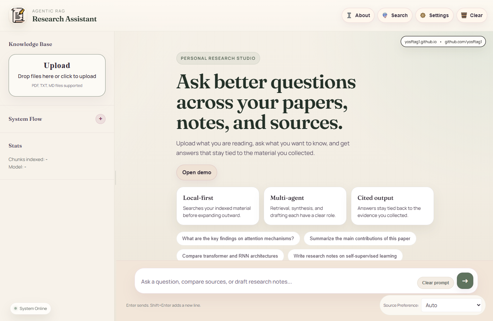

<p align="center">
  
</p>


<p align="center">
  <a href="https://www.python.org/"></a>
  <a href="https://fastapi.tiangolo.com/"></a>
  <a href="https://www.langchain.com/"></a>
  <a href="https://github.com/langchain-ai/langgraph"></a>
  <a href="https://www.trychroma.com/"></a>
  <a href="https://developer.mozilla.org/en-US/docs/Web/JavaScript"></a>
  <a href="https://render.com/"></a>
</p> 
# Personal Research Assistant

## Why I Built This

When reserach I got tired of drowning in research papers and articles. Every time I started a project, I'd collect tons of PDFs and references and go through them once by hand but it gets overwhelmign fast and you can lose track of a great idea you read in one paper just because of the sheer quantatiy so i wanted a way to be able to refrence the work fast and get quick summaries. I wanted a tool that could:

- Let me upload papers 
- Answer specific questions by actually reading through my materials
- Cite sources properly so I know where answers come from
- Work with whatever LLM I had available (OpenAI, Gemini, local Ollama)
- Look for reputable sources when trying to answer a reserach question quickly


> **Multi-agent RAG system for personal research** — ingest papers, ask questions, get cited answers.

**[Try the Live Demo](https://agentic-rag-research-assistant-3df2.onrender.com/)**

<p align="center">
  
</p>


## Architecture

**5 Agents** working together via LangGraph:
- **Orchestrator** — classifies intent, routes to agents, merges results
- **Retriever** — searches local vector store + web fallback
- **Summarizer** — single/multi-document summarization
- **Analyst** — comparative analysis with structured output
- **Writer** — drafts research notes, reviews, reports

## Quick Start

### 1. Install

```bash
cd research-assistant
python -m venv .venv
source .venv/bin/activate
pip install -e ".[dev]"
```

### 2. Configure

```bash
cp .env.example .env
# Edit .env and add your OPENAI_API_KEY
```

### 3. Ingest documents

```bash
# Single file
research-assistant ingest ./data/paper.pdf

# Entire directory
research-assistant ingest ./data/

# Web page
research-assistant ingest https://example.com/article
```

### 4. Ask questions

```bash
# Factual lookup
research-assistant query "What are the main findings on attention mechanisms?"

# Summarize
research-assistant query "Summarize the key contributions of this paper"

# Analyze
research-assistant query "Compare transformer and RNN architectures"

# Draft
research-assistant query "Write research notes on self-supervised learning"
```

### 5. Quick search (no agents)

```bash
research-assistant search "attention mechanism" --top-k 3
```

### 6. API server (optional)

```bash
uvicorn research_assistant.api.server:app --reload
# Docs at http://localhost:8000/docs
```

## Project Structure

```
src/research_assistant/
├── config.py              # Settings (pydantic-settings)
├── main.py                # CLI (Typer)
├── ingestion/             # Document loading → chunking → embedding
├── retrieval/             # Vector search + re-ranking
├── agents/                # LangGraph orchestrator + 4 specialized agents
├── tools/                 # Web search, citation tracking
└── api/                   # FastAPI server
```

## Supported Formats

| Format | Loader |
|--------|--------|
| PDF | PyPDF |
| Markdown | TextLoader |
| Plain text | TextLoader |
| Web pages | WebBaseLoader |

## Configuration

All settings can be configured via `.env` or environment variables:

| Variable | Default | Description |
|----------|---------|-------------|
| `OPENAI_API_KEY` | — | Required |
| `LLM_MODEL` | `gpt-4o` | Chat model |
| `EMBEDDING_MODEL` | `text-embedding-3-small` | Embedding model |
| `CHUNK_SIZE` | `1000` | Characters per chunk |
| `CHUNK_OVERLAP` | `200` | Overlap between chunks |
| `RETRIEVAL_TOP_K` | `5` | Results per query |
| `CHROMA_PERSIST_DIR` | `./chroma_db` | ChromaDB storage path |
| `DOC_REGISTRY_PATH` | `./doc_registry.db` | Document registry SQLite path |

## Using Local LLMs (Ollama)

If you want to use local models via [Ollama](https://ollama.com/), you can connect the hosted Web App directly to your local machine. The easiest way to do this is by using a tunneling service like [ngrok](https://ngrok.com/).

1. Start your local Ollama server.
2. Run ngrok to tunnel to the Ollama default port:
   ```bash
   ngrok http 11434
   ```
3. Copy the ngrok **Forwarding** URL (e.g. `https://xxxx-xxx.ngrok.app`).
4. In the app's **System Settings**, select "Ollama (Local)" for your LLM and/or Embedding Provider.
5. Paste the ngrok URL into the **Ollama Base URL** field. This allows the API to securely communicate with your local hardware!